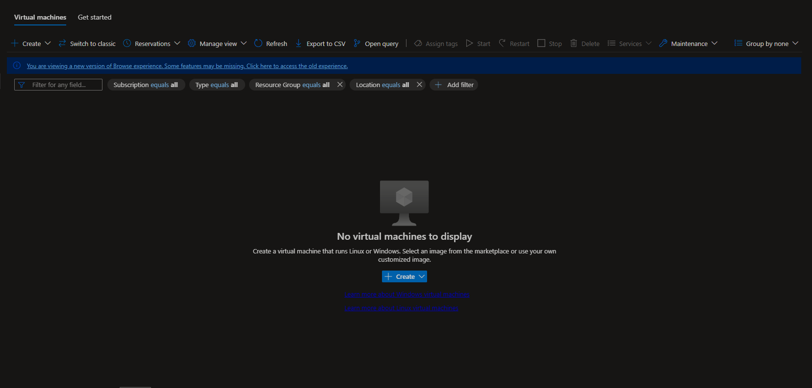
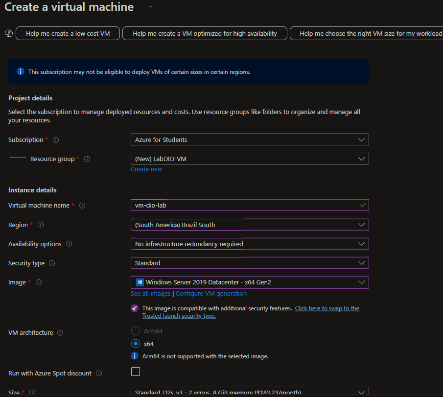

# 🚀 Resumo do Lab - Criando e Gerenciando Máquinas Virtuais na Azure ☁️

---

## 📚 Introdução

Este repositório foi criado como parte do desafio proposto na plataforma **Digital Innovation One (DIO)**.  
O objetivo principal foi consolidar os conhecimentos sobre **Máquinas Virtuais (VMs)** dentro da **Microsoft Azure**, aplicando na prática os conceitos abordados nas vídeo-aulas.

---

## ✅ Principais Aprendizados

### 🖥️ 1. O que é uma Máquina Virtual (VM)?

Uma **Máquina Virtual** é uma simulação de um computador físico, que roda dentro de um ambiente virtualizado.  
Ela permite executar sistemas operacionais, instalar aplicativos, hospedar serviços e testar soluções de software, sem a necessidade de um hardware físico dedicado.

---

### ☁️ 2. Criando uma VM no Azure

Durante o lab, aprendi o passo a passo para criar uma VM no **Portal da Azure**, incluindo:

- **Seleção do sistema operacional:** Escolhi uma imagem padrão do Windows Server.
- **Configuração de tamanho:** Ajustei os recursos de CPU, memória e armazenamento de acordo com o plano gratuito disponível.
- **Criação de usuário e senha:** Para acessar a VM posteriormente via RDP.
- **Configuração de regras de firewall:** Liberei a porta **3389 (RDP)** para conexões remotas.

---

### 🔑 3. Conectando-se à VM

Após a criação da VM:

✅ Realizei o download do arquivo de conexão **.rdp**.  
✅ Utilizei o **Remote Desktop Connection** para acessar a máquina de forma remota.  
✅ Testei funcionalidades dentro da VM, como abrir o navegador e explorar o sistema.

---

### 🛠️ 4. Gerenciamento de Recursos

Também aprendi a:

- **Iniciar**, **parar** e **excluir** a VM.  
- Monitorar o consumo de recursos (CPU, memória e rede) diretamente pelo portal da Azure.  
- Ajustar o tamanho da VM se necessário.

---

### 💡 5. Boas Práticas de Uso

- **Desligar a VM quando não estiver em uso**, para evitar cobrança de recursos.
- **Criar regras de segurança** apenas com o necessário (mínimo de portas abertas).
- **Monitorar logs de acesso** para garantir a segurança da máquina.

---

## 🧑‍💻 Tutorial: Como Criar uma Máquina Virtual na Azure Passo a Passo

### ✅ 1. Acessar o Portal da Azure

👉 Link: [https://portal.azure.com](https://portal.azure.com)

---

### ✅ 2. Criar uma nova Máquina Virtual

- No painel inicial, clique em **"Máquinas Virtuais"** no menu lateral esquerdo.
- Depois clique em **"Criar" > "Máquina Virtual"**.

---

### ✅ 3. Configurações Básicas

| Campo                        | O que preencher                                      |
|----------------------------- |--------------------------------------------------- |
| **Assinatura (Subscription)** | Azure for Students (ou sua assinatura gratuita)    |
| **Grupo de Recursos (Resource Group)** | Crie um novo, ex: `LabDIO-VM`                  |
| **Nome da Máquina Virtual (Virtual Machine Name)** | Exemplo: `vm-dio-lab`          |
| **Região (Region)**          | Escolha: `Brazil South` (ou a região mais próxima de você) |
| **Imagem (Image)**           | Exemplo: `Windows Server 2019 Datacenter` (ou outra de sua preferência) |
| **Tamanho (Size)**           | Selecione uma máquina gratuita (Exemplo: B1s ou menor) |
| **Nome de Usuário**          | Crie o nome de usuário para acesso remoto           |
| **Senha**                    | Crie uma senha forte para o acesso                  |
| **Availability Options**     | Escolha: `No infrastructure redundancy required`    |

---

### ✅ 4. Configuração de Acesso (Portas)

- Em **Regras de porta de entrada pública**, habilite a porta **RDP (3389)** para permitir acesso remoto.

---

### ✅ 5. Revisar e Criar

- Clique em **"Revisar + criar"**.
- Revise todos os detalhes da configuração.
- Clique em **"Criar"** para iniciar a implantação da sua VM.

---

### ✅ 6. Aguardar a Criação

- Espere de **1 a 3 minutos** até a VM ser provisionada.

---

### ✅ 7. Conectar-se à VM

- No painel da VM criada, clique em **"Conectar" > "RDP"**.
- Faça o download do arquivo `.rdp`.
- Abra o arquivo no seu computador.
- Insira o **nome de usuário** e a **senha** que você definiu.

---

### ✅ 8. Finalizando

⚠️ Importante:  
Quando terminar de usar sua VM, não esqueça de **Parar (Stop)** ou **Excluir (Delete)** a VM para evitar consumo de créditos.

---

## 📝 Conclusão

Esse laboratório foi fundamental para entender como criar, configurar e gerenciar uma **Máquina Virtual na Azure**.  
Agora me sinto mais preparada para utilizar VMs em projetos reais de desenvolvimento, testes ou ambientes de produção na nuvem.

---

## 📌 Recursos Utilizados

- [Documentação Oficial da Azure - Criar uma VM Windows](https://learn.microsoft.com/pt-br/azure/virtual-machines/windows/quick-create-portal)
- Plataforma: [https://portal.azure.com](https://portal.azure.com)
- Lab da DIO: **"Criando Máquinas Virtuais no Azure"**

---

> ✅ Repositório criado para o desafio final da DIO.
